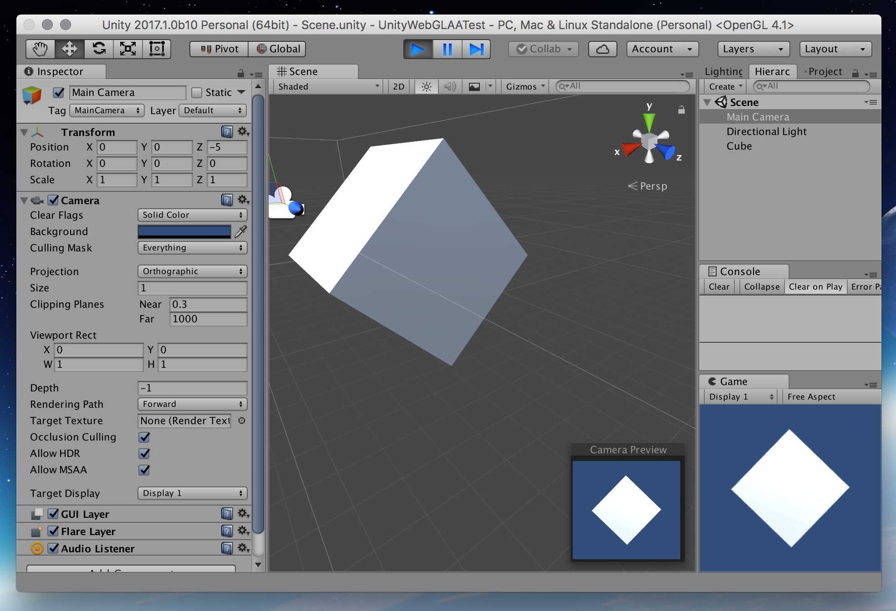
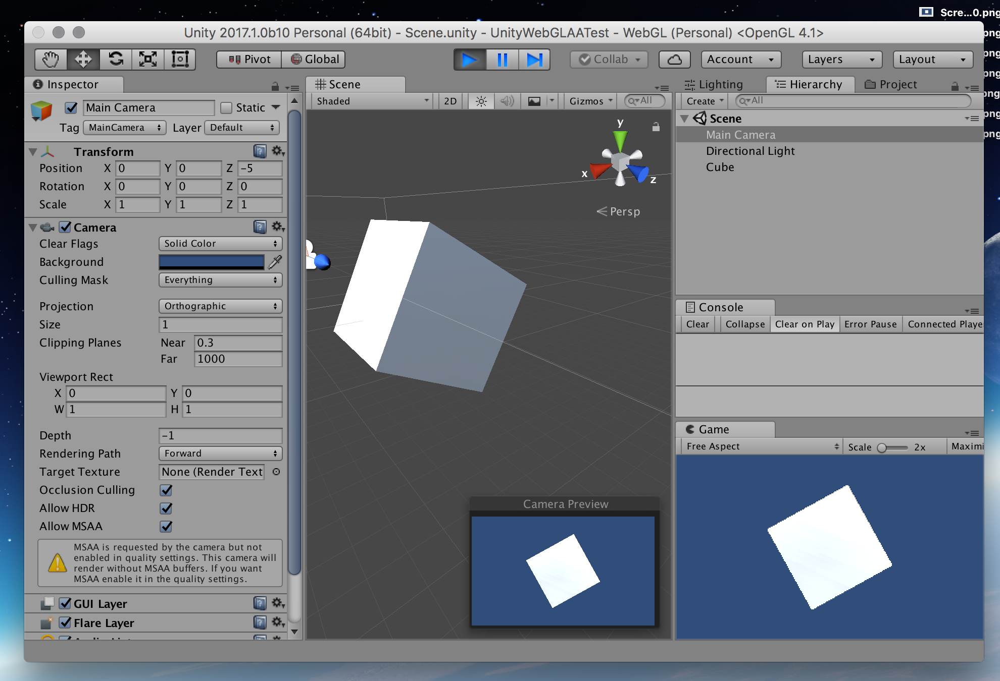

# UnityWebGLAATest

Test project to demonstrate **[Unity AA issue in WebGL builds](https://fogbugz.unity3d.com/default.asp?923698_lp2aa0rrm5mclcgu)** when using the **forward rendering path**.

AA settings in Unity apply in the Editor but not in WebGL builds (see the screenshots below)

**Tested with:**

- macOS 10.12.5 (16F73) 
- Safari 10.1.1 (12603.2.4) 
- Chrome (59.0.3071.115)
- Unity 5.6.1f1
- Unity 2017.1.0b10

# Screenshots

## Editor (AA 8) 
AA enabled in editor

## Editor (AA 0) 
AA disabled in editor

## Build (AA 8)
Build with AA enabled
 

## Build (AA 0)
Build with AA disabled

